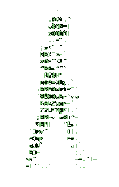

  

<h1 align="center">Hi 👋, I'm Kamal Sinha</h1>
<h3 align="center">Electronics & Communication Engineer @ VIT | BSc Data Science @ IIT Madras | Co-Founder @ Imaginum | Full-Stack & Software Developer</h3>

  

- 🔭 I’m currently working on **Vexa Web App**
- 🌱 I’m currently learning **DevOps**
- 💬 Ask me about **Android, MERN Stack**
- 📫 How to reach me: **kamalsinha7305@gmail.com**
- ⚡ Fun fact: **I am Funny**

### 📫 Let's Connect!

  
  
  
  

### 🚀 Tech Stack

  
  
  
  
  
  
  
  
  
  
  
  
  
  
  
  
  
  
  
  
  
  
  
  
  
  
  
  
  
  
  
  

### 📊 GitHub Stats
<table>
  <tr>
    <td></td>
    <td></td>
  </tr>
  <tr>
    <td colspan="2" align="center">
      
    </td>
  </tr>
</table>

### 📈 Contribution Graph
<picture>
  <source media="(prefers-color-scheme: dark)" srcset="https://raw.githubusercontent.com/kamalsinha7305/kamalsinha7305/output/pacman-contribution-graph-dark.svg">
  <source media="(prefers-color-scheme: light)" srcset="https://raw.githubusercontent.com/kamalsinha7305/kamalsinha7305/output/pacman-contribution-graph.svg">
  
</picture>

